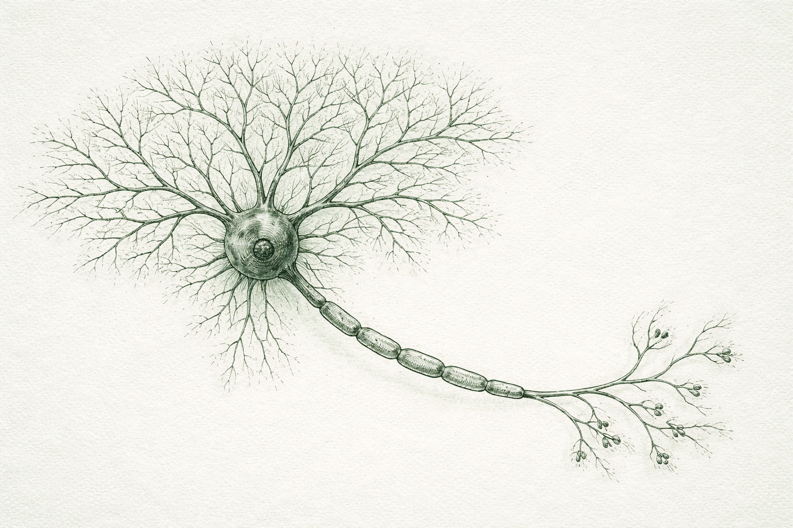

### Introduction

- In order to updates the weights and biases of a neural network, we need to know by how much each of it need to be adjusted based on the loss the neural network is currently making while training on the dataset.

- This is done by using backpropagation.

```python
a = 10
print(a)
```

$$x = y + x$$



### References

1. [https://cs231n.github.io/optimization-2/](https://cs231n.github.io/optimization-2/)
